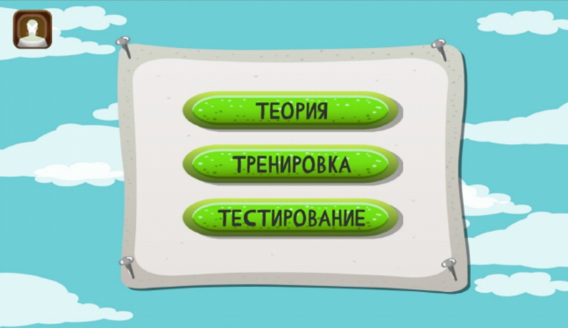
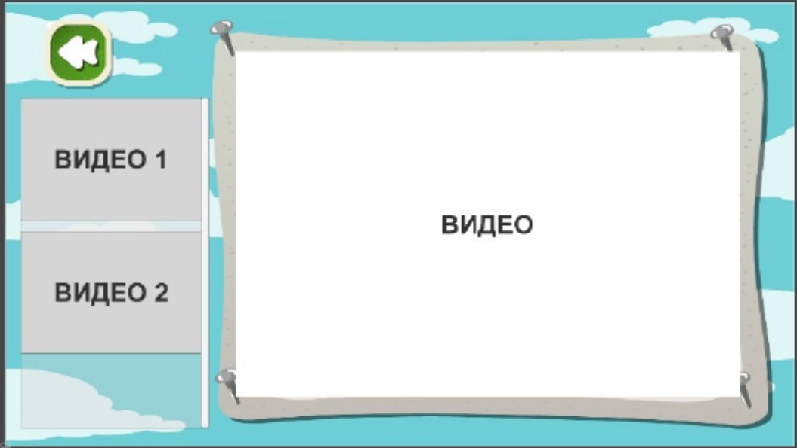

# Block Diagram Simulator - "Professionals 2023" Project

This project was developed for the "Professionals 2023" competition using Unity and SQL. It is an educational block diagram simulator designed to help users build and execute block diagrams, visually representing the logic and flow of a program. Users can create block diagrams and then run them to see the results of their constructed programs in real-time.

##

## Features

### User Roles and Authentication
- **Roles**: There are three roles within the app: **Student**, **Teacher**, and **Administrator**.
  - **Administrator**: Has full control over user management. Administrators can add new users and assign them roles. Unlike other users, administrators have access to a full list of registered users and are responsible for managing user accounts.
  - **Teacher**: Can create assignments that students can complete by constructing block diagrams. Teachers can also provide a text-based description of the problem for guidance.
  - **Student**: Can use the app in two modes: **Assignment Mode** and **Free Training Mode**.
- **Authentication**: Only administrators can register new users. Students and teachers cannot register themselves, ensuring controlled access to the simulator.

### Block Diagram Construction and Execution
- **Assignment Mode**: In this mode, students can complete assignments created by teachers. Each assignment involves constructing a block diagram to solve a given problem and is accompanied by a text-based description for guidance. Once the diagram is built, students can execute it to see if the output matches the expected results.
  
  

- **Free Training Mode**: Students can freely explore and practice constructing block diagrams without restrictions. This mode is ideal for experimentation and improving understanding of block diagram logic.

### Theory Videos
- **Educational Content**: The app includes a collection of theory videos that provide foundational knowledge and guidance for constructing block diagrams. Students can watch these videos to enhance their understanding and improve their diagram-building skills.

  

### Database Integration
- **SQL Database**: All actions within the app are saved to a SQL database, including user registration, role assignments, diagram creation, and assignment completion. This ensures data persistence and enables detailed tracking of user progress and activity.

## How It Works

1. **User Authentication**: Administrators add users to the system with specific roles. Once registered, users can log in with their assigned credentials.
  
2. **Main Menu**: Based on the user role, the main menu provides access to relevant features. Students can enter assignment mode, access training mode, or watch theory videos, while administrators have access to user management.

3. **Assignment Mode**: Students complete assignments by constructing block diagrams according to teacher-provided descriptions. Diagrams can be executed to check if they solve the problem correctly.

4. **Free Training Mode**: Students can practice building block diagrams without the constraints of assignments, allowing for experimentation and skill development.

5. **Theory Videos**: Educational videos provide theoretical background and guidance, helping students understand the concepts needed to build effective block diagrams.

## User Roles and Permissions

- **Administrator**: Manages user accounts, adds new users, and assigns roles. Has access to a complete list of users.
- **Teacher**: Creates assignments with problem descriptions for students to complete. Can track student progress on these assignments.
- **Student**: Builds and executes block diagrams in assignment mode and training mode. Can access theory videos for additional guidance.

## Getting Started

1. Clone the repository and open the project in Unity.
2. Set up the SQL database and configure user accounts through the administrator role.
3. Use the app to create assignments (teachers) or complete assignments and practice (students).

## Usage

In the app, users can:

- Build and execute block diagrams to simulate program logic.
- Complete assignments in "Assignment Mode" or practice freely in "Training Mode."
- Watch theory videos to gain a deeper understanding of block diagram concepts.
- Administrators can manage user accounts and roles, ensuring a structured and controlled learning environment.

---

# Тренажёр Блок-Схем - Проект "Профессионалы 2023"

Этот проект был разработан для конкурса "Профессионалы 2023" с использованием Unity и SQL. Это образовательный тренажёр блок-схем, созданный для помощи пользователям в построении и выполнении блок-схем, представляющих логику и последовательность программы. Пользователи могут создавать блок-схемы и запускать их, чтобы увидеть результат работы своих программ в режиме реального времени.

##

## Особенности

### Роли Пользователей и Аутентификация
- **Роли**: В приложении есть три роли: **Ученик**, **Учитель** и **Администратор**.
  - **Администратор**: Имеет полный контроль над управлением пользователями. Администратор может добавлять новых пользователей и назначать им роли. Администратор также имеет доступ к списку всех пользователей и управляет учётными записями.
  - **Учитель**: Создаёт задания, которые ученики могут выполнять, строя блок-схемы. Учитель также может предоставить текстовое описание проблемы для руководства.
  - **Ученик**: Использует приложение в двух режимах: **Режим Заданий** и **Режим Тренировки**.
- **Аутентификация**: Только администратор может регистрировать новых пользователей. Ученики и учителя не могут зарегистрироваться самостоятельно, что обеспечивает контролируемый доступ к тренажёру.

### Построение и Выполнение Блок-Схем
- **Режим Заданий**: В этом режиме ученики могут выполнять задания, созданные учителями. Каждое задание включает построение блок-схемы для решения заданной проблемы и сопровождается текстовым описанием для помощи. После построения схемы ученик может запустить её, чтобы проверить, соответствует ли результат ожидаемому.

  

- **Режим Тренировки**: Ученики могут свободно практиковаться в построении блок-схем без ограничений. Этот режим идеально подходит для экспериментов и улучшения понимания логики блок-схем.

### Видео Теории
- **Образовательный Контент**: Приложение включает коллекцию видео, которые предоставляют теоретическую базу и руководство по построению блок-схем. Ученики могут просматривать эти видео для углубления знаний и улучшения навыков построения схем.

  

### Интеграция с Базой Данных
- **SQL База Данных**: Все действия в приложении сохраняются в SQL базе данных, включая регистрацию пользователей, назначение ролей, создание схем и выполнение заданий. Это обеспечивает сохранность данных и возможность подробного отслеживания прогресса пользователей.

## Как Это Работает

1. **Аутентификация Пользователей**: Администраторы добавляют пользователей в систему с указанием ролей. После регистрации пользователи могут войти в систему, используя свои учётные данные.
  
2. **Главное Меню**: В зависимости от роли пользователя, главное меню предоставляет доступ к соответствующим функциям. Ученики могут войти в режим задания, режим тренировки или посмотреть теоретические видео, а администраторы имеют доступ к управлению пользователями.

3. **Режим Заданий**: Ученики выполняют задания, создавая блок-схемы на основе описания учителя. Блок-схемы можно запустить для проверки правильности решения.

4. **Режим Тренировки**: Ученики могут практиковаться в построении блок-схем без ограничений, что позволяет экспериментировать и развивать навыки.

5. **Видео Теории**: Образовательные видео предоставляют теоретическую информацию и помогают ученикам лучше понимать концепции, необходимые для построения блок-схем.

## Роли и Полномочия Пользователей

- **Администратор**: Управляет учётными записями пользователей, добавляет новых пользователей и назначает роли. Имеет доступ к списку пользователей.
- **Учитель**: Создаёт задания с описаниями для выполнения учениками. Может отслеживать прогресс учеников по выполненным заданиям.
- **Ученик**: Создаёт и выполняет блок-схемы в режиме задания и режиме тренировки. Может просматривать теоретические видео для улучшения навыков.

## Начало Работы

1. Склонируйте репозиторий и откройте проект в Unity.
2. Настройте SQL базу данных и создайте учётные записи через администратора.
3. Используйте приложение для создания и выполнения заданий (учителя и ученики) или для управления пользователями (администраторы).

## Использование

В приложении пользователи могут:

- Строить и выполнять блок-схемы для симуляции логики программ.
- Выполнять задания в режиме "Заданий" или тренироваться в свободном режиме.
- Смотреть теоретические видео для углубления знаний.
- Администраторы могут управлять учётными записями и ролями, обеспечивая структурированное и контролируемое образовательное пространство.

